Instalar DB2-Express-C 11.1 en CentOS 6.5
=========================================

Primero que todo estos son los link que me ayudaron a crear esta documentacion:
http://www.tldp.org/HOWTO/DB2-HOWTO/index.html
http://db2express.com/es/
http://docs.oracle.com/cd/E11882_01/server.112/e40540/toc.htm
http://docs.oracle.com/cd/E17781_01/index.htm

¿Por qué DB2 Express-C?
++++++++++++++++++++++++
DB2 Express-C™ es la versión gratuita de uno de los mas avanzados sistemas de administración de base de datos del mundo. ¿Por qué pagar cuando usted puede tener todo sin costo? DB2 Express-C es gratis para desarrollar, utilizar en producción y distribuir.
Es un servidor de datos rápido, seguro, fiable, e increíblemente escalable, ideal para la mayoría de empresas que recién empiezan o pequeñas y medianas empresas ya establecidas. DB2 Express-C 11.1 está disponible en Linux, UNIX, Windows y ahora en la Mac OS X!. También permite a los desarrolladores manejar fácilmente XML nativo a través de la tecnología de almacenamiento llamada pureXML™. Si usted desarrolla en Java, .Net, Ruby, Python, Perl o casi cualquier otro lenguaje de programación disponible, DB2 pueden ser su ventaja tecnológica.

No hay Límites de Datos
++++++++++++++++++++++++
DB2 Express-C no es una versión limitada de DB2. Al contrario, DB2 Express-C comparte el mismo código que el resto de las ediciones comerciales y tiene una generosa licencia, que no impone límites a su base de datos. Esto significa que en su servidor puede tomar ventaja de:

* Hasta 2 núcleos (1 CPU)
* Hasta 16 GB de memoria RAM
* 15 TB
* No hay límites de conexiones
* No hay límites de usuarios u cualquier otro tipo de limites

Prerequisitos
+++++++++++++++

Hardware Supported processor architectures
--------------------------------------------
* x86 (32-bit processor)
* x86–64 (64-bit processor)
* POWER™ (any iSeries™ or pSeries® that supports Linux)

Hardware Disk space requirements
--------------------------------
* Typical:DB2 is installed with most features and functionality, including graphical tools such as the Control Center. 460 to 560 MB

* Compact: DB2 is installed with basic features and functionality, but without the graphical tools. 380 to 460 MB

* Custom: This option allows you to select the features and functionality that you want to install. 320 to 820 MB

Hardware Memory requirements
--------------------------------
Recomendamos un mínimo de 512 MB ​​de memoria RAM para DB2 Express-C 11.1, y el resto de la memoria debería ser asignado para otros procesos de software y de la comunicación. Al determinar los requisitos de memoria, tenga en cuenta los siguientes puntos :
* Su espacio de swap debe ser al menos el doble que la memoria RAM .
* La memoria adicional debe asignarse para cualquier software que no sea de DB2 que se esté ejecutando en el sistema.
* es necesaria memoria adicional para apoyar a los clientes de bases de datos y la actividad de la base de datos .
* Estos requisitos de memoria se verán afectados por el tamaño y la complejidad de su sistema de base de datos , así como los requisitos específicos de rendimiento .
* La memoria RAM máxima permitida para una instalación de DB2 Express-C es de 4 GB .

Software requirientos
---------------------
El sistema de ventanas X, gestor de gráficos (KDE, Gnome, etc.). Lo necesitará si desea utilizar el instalador de DB2 gráfica, o cualquiera de las herramientas gráficas de DB2.

Los paquetes adicionales , como se indica:
* basic-desktop 
* compat-libstdc++
* nfs-utils
* numactl

Consideraciones sobre la instalación y la planificación
--------------------------------------------------------
Después de verificar que el sistema cumple los requisitos básicos, se debe planificar la instalación teniendo en cuenta los métodos de instalación y la creación de usuarios y grupos:

Las opciones de instalación.

- db2setup installation
	- db2_install installation
	- instalación por archivo de respuestas de DB2
- Usuario y grupo de configuración:
	- Requisitos de usuario y de grupo
	- Creación de usuarios

Metodos de instalacion
------------------------
db2setup installation
---------------------
Utilizando db2setup es el mejor método para los usuarios menos experimentados , porque la mayor parte de la configuración se realiza automáticamente durante la instalación . Como se mencionó anteriormente , se necesita un sistema X Window capaz de representar una interfaz gráfica de usuario para utilizar db2setup con éxito .

db2_install installation
-------------------------
Este método es fiable y comúnmente utilizado por usuarios expertos para la instalación de DB2 en sistemas más grandes y complejos. Una limitación a db2_install es que sólo se instala asistencia al usuario (como ayuda , mensajes e interfaces de las herramientas ) en Inglés , mientras que db2setup es compatible con la instalación de otros idiomas . Además, una instalación db2_install puede tomar más tiempo ( debido a la mayor cantidad de tareas de configuración manual ) ; se requiere un mayor nivel de conocimiento y habilidad, y no puede ser usado para crear archivos de respuestas.

instalación por archivo de respuestas de DB2
-----------------------------------------------

Un archivo de respuestas se pueden crear utilizando el Asistente de instalación de DB2 o editar un archivo de respuestas de DB2 (.rsp) existente. Se le permite instalar DB2 en varias máquinas con configuraciones de instalación y configuración consistentes. Una instalación de archivo de respuestas es rápido, ya que no pasa por el asistente gráfico de configuración . Otra ventaja de utilizar un archivo de respuestas en lugar del comando db2_install es que crea una base de datos del Servidor de administración (DAS) en cada máquina , mientras que con db2_install El DAS se debe crear manualmente después de la instalación.

Usuario y grupo de configuración:
------------------------------------

DB2 requiere un mínimo de tres usuarios y grupos: un propietario instance, un usuario delimitado, y el usuario de administración del servidor de base de datos (DAS). Es posible utilizar los nombres predeterminados proporcionados por las utilidades de configuración, o especificar sus propios nombres de usuario y de grupo . Por ejemplo, considere los siguientes identificadores de usuario por defecto y los nombres de los grupos producidos por la ejecución de instalación de DB2:

- Instance owner: db2inst1 - Administers a DB2 instance
- Fenced user: db2fenc1 - Responsible for executing "fenced" user defined functions, such as JDFs and stored procedures
- DAS user: dasusr1 - Administers the DB2 Administration Server

Asegurar estos prerequisitos
+++++++++++++++++++++++++++

Configurar el nombre del HOST en el archivo /etc/hosts::

	# vi /etc/hosts
	127.0.0.1   localhost localhost.localdomain localhost4 localhost4.localdomain4
	::1         localhost localhost.localdomain localhost6 localhost6.localdomain6
	192.168.1.21	cdc01

Conectar con ssh -X para tener disponible la configuracion grafica y tener la variable DISPLAY activa.

Instalando xorg-x11-server-Xorg.x86_64.::

	# yum -y install xorg-x11-server-Xorg.x86_64

Instalando xorg-x11-xauth.::

	# yum install xorg-x11-xauth

**Archivos de configuración**

En el server debe tener estas lineas /etc/ssh/sshd_config::

	X11Forwarding yes
	X11DisplayOffset 10
	X11UseLocalhost no

En el cliente debe tener estas lineas ~/.ssh/config ::

	Host *
	  ForwardAgent yes
	  ForwardX11 yes

**Test ssh forward a las X**

Nos conectamos al servidor con ssh y le pasamos el parámetro ".X" y debemos consultar la variable DISPLAY y el ssh debe fijarle el valor automaticamente.::
 
	$ ssh -X root@192.168.1.21
	root@192.168.1.21's password: 
	Last login: Wed Oct  3 19:42:07 2018 from 192.168.1.4
	/usr/bin/xauth:  file /root/.Xauthority does not exist
	# echo $DISPLAY
	localhost:10.0

**Instalar unas aplicaciones X**

Siempre es bueno tener alguna aplicación en X para hacer un test. Como siempre olvido cual es el paquete que la tiene xclock, pues.::

	# yum provides '*/xclock'
	Complementos cargados:fastestmirror
	Loading mirror speeds from cached hostfile
	 * base: mirror.uta.edu.ec
	 * extras: mirror.uta.edu.ec
	 * updates: mirror.uta.edu.ec
	base/7/x86_64/filelists_db	| 6.9 MB  00:00:29     
	extras/7/x86_64/filelists_db	| 603 kB  00:00:02     
	updates/7/x86_64/filelists_db	| 3.2 MB  00:00:15     
	xorg-x11-apps-7.7-7.el7.x86_64 : X.Org X11 applications
	Repositorio        : base
	Resultado obtenido desde:
	Nombre del archivo    : /usr/bin/xclock

Instalamos el paquete que descubrimos que tiene xclock.::

	# yum install xorg-x11-apps-7.7-7.el7.x86_64

Ahora desde el servidor ejecutamos el xclock y debemos ver este aplicativo en nuestras X.::

	# xclock

Debe estar **configurado el locale** en ingles para que no pida el paquete adicional de idiomas.::

	# export LANG=en_US.utf8 LC_ALL=en_US.utf8

	# locale
	LANG=en_US.utf8
	LC_CTYPE="en_US.utf8"
	LC_NUMERIC="en_US.utf8"
	LC_TIME="en_US.utf8"
	LC_COLLATE="en_US.utf8"
	LC_MONETARY="en_US.utf8"
	LC_MESSAGES="en_US.utf8"
	LC_PAPER="en_US.utf8"
	LC_NAME="en_US.utf8"
	LC_ADDRESS="en_US.utf8"
	LC_TELEPHONE="en_US.utf8"
	LC_MEASUREMENT="en_US.utf8"
	LC_IDENTIFICATION="en_US.utf8"
	LC_ALL=en_US.utf8

Instalando DB2-Express-C 11.1
+++++++++++++++++++++++++++++++

Instalar los paquetes requeridos.::

	# yum --disablerepo=\* --enablerepo=c6-media groupinstall basic-desktop
	# yum --disablerepo=\* --enablerepo=c6-media install compat-libstdc++-33 libXtst
	# yum --disablerepo=\* --enablerepo=c6-media search nfs-utils

Este lo puedes instalar del repo, pero como el server no tenia acceso al internet lo descarguede http://rpm.pbone.net/index.php3/stat/3/srodzaj/1/search/numactl .::

	# rpm -ivh /tmp/numactl-2.0.9-2.el6.x86_64.rpm

Podemos crear los grupos de una vez o simplemente lo hacemos con el instalador.::

	# mkdir /db2home

.::

	# groupadd db2grp1
	# groupadd db2fgrp1
	# groupadd dasadm1

.::

	# useradd -g db2grp1  -m -d /db2home/db2inst1 db2inst1 -p password1
	# useradd -g db2fgrp1 -m -d /db2home/db2fenc1 db2fenc1 -p password2
	# useradd -g dasadm1  -m -d /db2home/dasusr1 dasusr1 -p password3

Si queremos agregar un usuario existente a la administracion lo colocamos dentro del grupo en /etc/group.::

	db2grp1:x:102:cgomez,lbell

Procedemos a copiar el paquete de v11.1_linuxx64_expc.tar.gz dentro del servidor y extraerlo.::

	# tar -xvzf v11.1_linuxx64_expc.tar.gz
	# cd expc/
	# ls
	db2  db2ckupgrade  db2_deinstall  db2_install  db2ls  db2prereqcheck  db2setup

Intentamos instalar.::

	# ./db2setup
	Requisito no cumplido para la base de datos DB2 "Server" . Versión: "11.1.0.0". 

	Resumen de los requisitos previos que no se cumplen en el sistema actual: 

	   DBT3514W  El programa de utilidad db2prereqcheck no ha podido encontrar el siguiente archivo de biblioteca de 32 bits: "/lib/libpam.so*". 

	DBT3514W  El programa de utilidad db2prereqcheck no ha podido encontrar el siguiente archivo de biblioteca de 32 bits: "libstdc++.so.6". 

	   Distribución del sistema operativo mínima necesaria: "CENTOS"; versión: "6"; service pack: "7". 
	   Versión de distribución del sistema operativo real: "6"; service pack: "5". 

	  Aborting the current installation ...
	  Run installation with the option "-f sysreq" parameter to force the installation.

Hay unos paquetes que no no importa que son de 32 bit y nuestro sistema es de 64 bit, por eso los omitimos, nos indica que no tenemos el service pack actualizado del CentOS lo omito por no tener en estos momentos salida al internet. volvemos a ejecutar el instalador con los parametros que el nos recomienda.::

	# ./db2setup -f sysreq
	Requisito no cumplido para la base de datos DB2 "Server" . Versión: "11.1.0.0". 

	Resumen de los requisitos previos que no se cumplen en el sistema actual: 

	   DBT3514W  El programa de utilidad db2prereqcheck no ha podido encontrar el siguiente archivo de biblioteca de 32 bits: "/lib/libpam.so*". 

	DBT3514W  El programa de utilidad db2prereqcheck no ha podido encontrar el siguiente archivo de biblioteca de 32 bits: "libstdc++.so.6". 

	   Distribución del sistema operativo mínima necesaria: "CENTOS"; versión: "6"; service pack: "7". 
	   Versión de distribución del sistema operativo real: "6"; service pack: "5". 

	  The force option "-f sysreq" is used to force the installation ...

	DBI1190I  db2setup está preparando el Asistente de instalación de DB2 que le  conducirá por el proceso de instalación del programa. Espere, por favor.

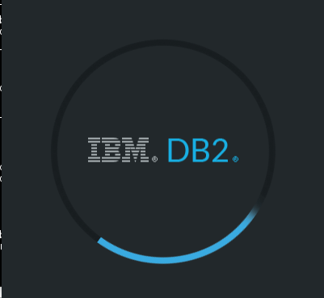
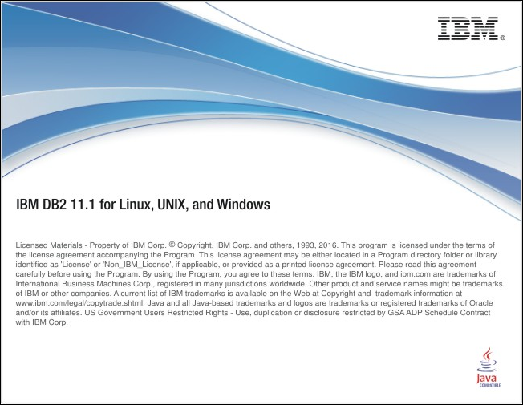
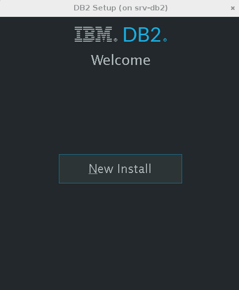
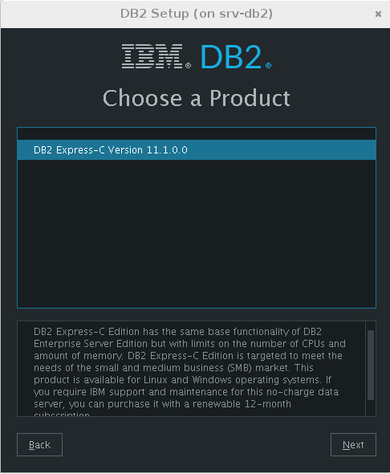
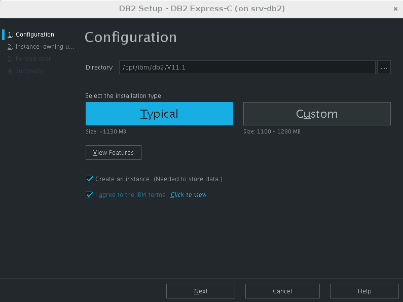
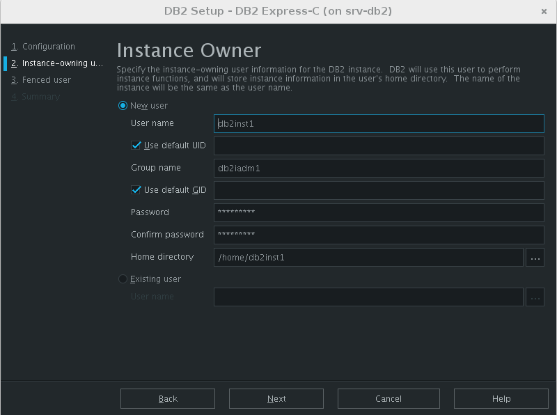
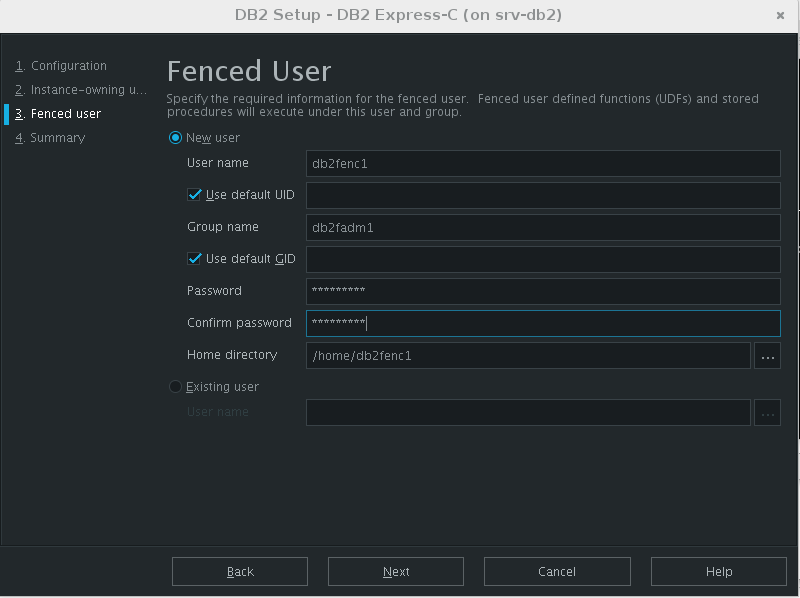
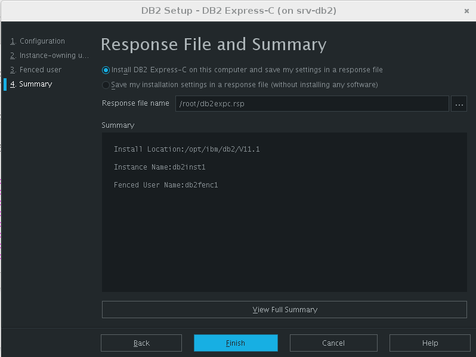
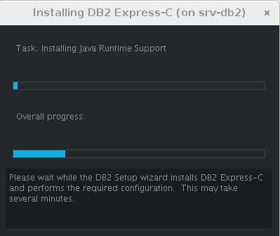
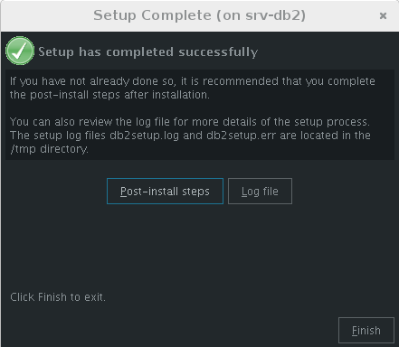
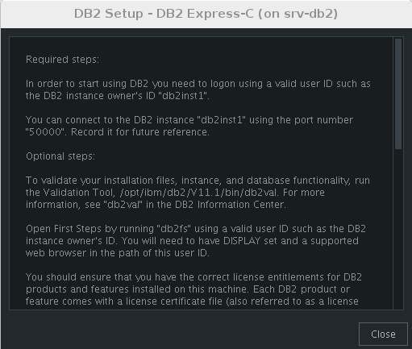

Despues de instalado vemos los servicios.::

	# ps -ef | grep db2
	root      1909     1  0 21:10 ?        00:00:00 /opt/ibm/db2/V11.1/bin/db2fmcd
	root      9669     1  0 21:10 ?        00:00:00 db2wdog                                                     
	db2inst1  9671  9669  0 21:10 ?        00:00:00 db2sysc                                        
	root      9677  9669  0 21:10 ?        00:00:00 db2ckpwd                                                    
	root      9678  9669  0 21:10 ?        00:00:00 db2ckpwd                                                    
	root      9679  9669  0 21:10 ?        00:00:00 db2ckpwd                                                    
	db2inst1  9681  9669  0 21:10 ?        00:00:00 db2vend (PD Vendor Process - 1)                                                                                                                                                                           
	db2inst1  9688  9669  0 21:10 ?        00:00:00 db2acd   ,0,0,0,1,0,0,00000000,0,0,0,0000000000000000,0000000000000000,00000000,00000000,00000000,00000000,00000000,00000000,0000,00000000,00000000,00000000,00000000,00000000,00000000,00000000,00000000,0000000022cd4000,0000000000000000,0000000000000000,1,0,0,,,,,a7ffd0,14,1e014,2,0,1,0000000000041fc0,0x240000000,0x240000000,1600000,78002,2,d8013

Iniciar con el usuario que administrara la instancia.::

	# su - db2inst1
	$ pwd
	/home/db2inst1

Para estar seguros, detenemos y iniciamos el servicio.::

	$ db2stop
	SQL1064N  DB2STOP processing was successful.
	$ ps -ef | grep db2
	$ db2start 
	SQL1063N  DB2START processing was successful.
	$ ps -ef | grep db2
	root      1909     1  0 21:10 ?        00:00:00 /opt/ibm/db2/V11.1/bin/db2fmcd
	root     10311  1345  0 21:16 pts/0    00:00:00 su db2inst1
	db2inst1 10312 10311  0 21:16 pts/0    00:00:00 bash
	root     10455     1  0 21:17 pts/0    00:00:00 db2wdog                                                     
	db2inst1 10457 10455  1 21:17 pts/0    00:00:00 db2sysc                                        
	root     10463 10455  0 21:17 pts/0    00:00:00 db2ckpwd                                                    
	root     10464 10455  0 21:17 pts/0    00:00:00 db2ckpwd                                                    
	root     10465 10455  0 21:17 pts/0    00:00:00 db2ckpwd                                                    
	db2inst1 10467 10455  0 21:17 pts/0    00:00:00 db2vend (PD Vendor Process - 1)                                                                                                                                                                           
	db2inst1 10474 10455  0 21:17 pts/0    00:00:00 db2acd   ,0,0,0,1,0,0,00000000,0,0,0,0000000000000000,0000000000000000,00000000,00000000,00000000,00000000,00000000,00000000,0000,00000000,00000000,00000000,00000000,00000000,00000000,00000000,00000000,0000000022cd4000,0000000000000000,0000000000000000,1,0,0,,,,,a7ffd0,14,1e014,2,0,1,0000000000041fc0,0x240000000,0x240000000,1600000,98002,2,178014
	db2inst1 10483 10312  0 21:17 pts/0    00:00:00 ps -ef
	db2inst1 10484 10312  0 21:17 pts/0    00:00:00 grep db2

Para obtener mas informacion.::

	$ db2val 
	DBI1379I  The db2val command is running. This can take several minutes.

	DBI1335I  Installation file validation for the DB2 copy installed at
		  /opt/ibm/db2/V11.1 was successful.

	DBI1339I  The instance validation for the instance db2inst1 was
		  successful.

	DBI1343I  The db2val command completed successfully. For details, see
		  the log file /tmp/db2val-160917_211847.log.

Listamos las base de datos existentes.::

	$ db2 LIST DATABASE DIRECTORY
	SQL1031N  The database directory cannot be found on the indicated file system. 
	SQLSTATE=58031

Como no hay creamos una. Esto va demorar, ten paciencia.::

	$ db2 create database test  
	DB20000I  The CREATE DATABASE command completed successfully.

Listamos nuevamente las base de datos.::

	$ db2 LIST DATABASE DIRECTORY

	 System Database Directory
	 Number of entries in the directory = 1
	Database 1 entry:
	 Database alias                       = TEST
	 Database name                        = TEST
	 Local database directory             = /home/db2inst1
	 Database release level               = 14.00
	 Comment                              =
	 Directory entry type                 = Indirect
	 Catalog database partition number    = 0
	 Alternate server hostname            =
	 Alternate server port number         =

Nos conectamos a la base de datos.::

	$ db2 connect to test

	   Database Connection Information

	 Database server        = DB2/LINUXX8664 11.1.0
	 SQL authorization ID   = DB2INST1
	 Local database alias   = TEST

Creamos una tabla de prueba.::

	$ db2 "create table test.mytable (id int, username varchar(20))"
	DB20000I  The SQL command completed successfully.

Insertamos unos registros a la tabla.::

	$ db2 "INSERT INTO test.mytable VALUES(1, 'CarlGom')"
	DB20000I  The SQL command completed successfully.
	$ db2 "INSERT INTO test.mytable VALUES(2, 'LuSanc')"
	DB20000I  The SQL command completed successfully.

Consultamos la tabla.::

	$ db2 "select * from test.mytable"

	ID          USERNAME            
	----------- --------------------
		      1 CarlGom             
		      2 LuSanc              

	  2 record(s) selected.

Listamos todas las tablas.::

	$ db2 list tables for all | grep -i test

Consultamos que DB2 este escuchando por su puerto que es el 5000.::

	# netstat -natp | grep db2
	tcp        0      0 0.0.0.0:50000               0.0.0.0:*                   LISTEN      10457/db2sysc

