Instalar DB2-Express 10.1
========================

Vamos a instalar el manejador de Base de Datos de IBM DB2 10.1 express...!!! Lo primero que debemos hacer es iniciar en nuestro servidor con ssh -X para que tengamos el Forwarding de las X11::

	ssh -X root@192.168.1.100

Instalamos prerrequisitos::

	# yum -y install compat-libstdc++-33 libXtst

Creamos el home directory en donde estará los archivos y configuración para instanciar la BD de DB2::

	# mkdir /db2home

Debemos tener el instalador de IBM DB2 10.1 express que es **db2_v101_linuxx64_expc_lite.tar.gz**::

	# ls -l db2_v101_linuxx64_expc_lite.tar.gz

Descomprimimos el paquete en donde esta el instalador de IBM DB2 10.1::

	# tar xvzf db2_v101_linuxx64_expc_lite.tar.gz

Ingresamos en la carpeta descomprimida hasta llegar en donde estan los instaladores::

	# cd devinst/db2_galileo/linuxamd64/s120403/expc_lite/d

	# ls 
	db2  db2ckupgrade  db2_deinstall  db2_install  db2ls  db2prereqcheck  db2setup

Procedemos con la instalación::

	# ./db2setup 
	DBI1190I  db2setup is preparing the DB2 Setup wizard which will guide
	      you through the program setup process. Please wait.

Al ejecutar el comando y si tenemos bien configurada el forwarding de las X11 veremos una ventana como las siguientes en las cuales podemos ir interactuando con ella, en nuestro caso vamos a seleccionar **Install Product**

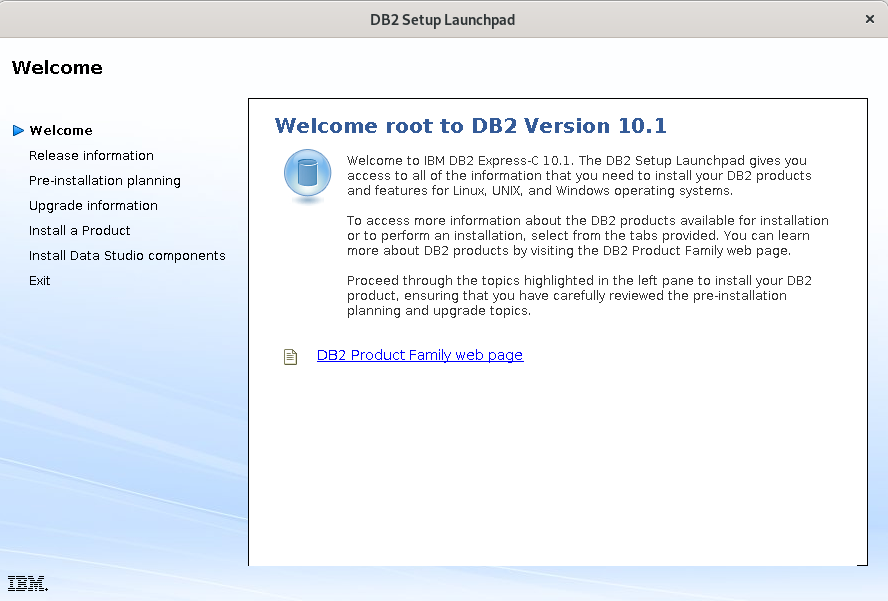
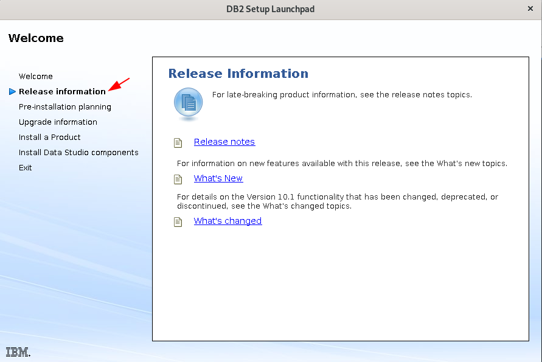
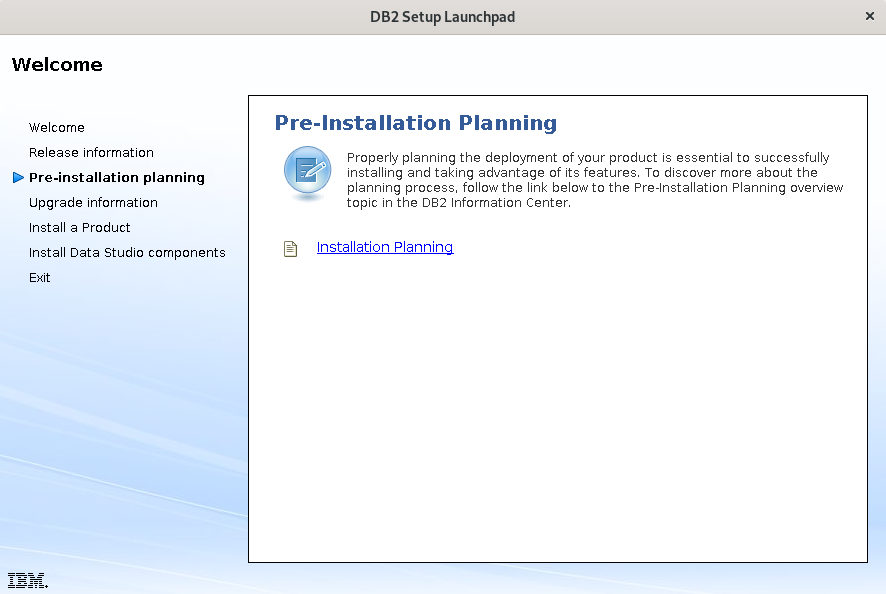
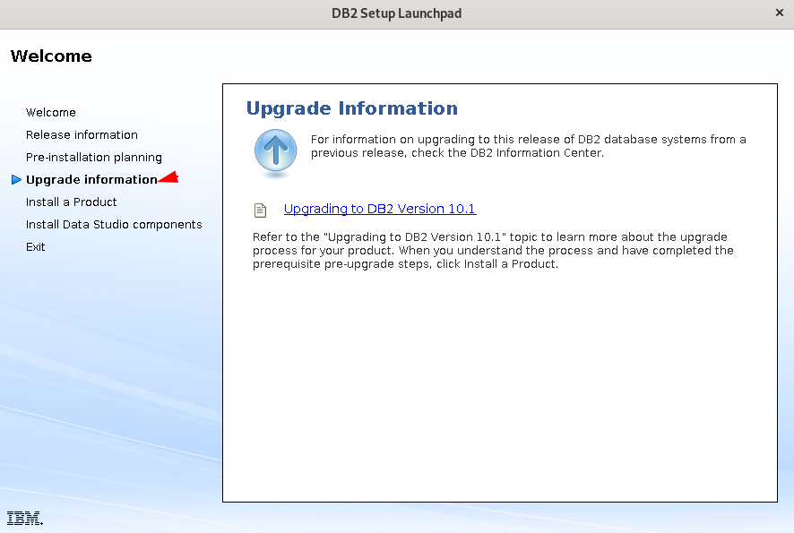
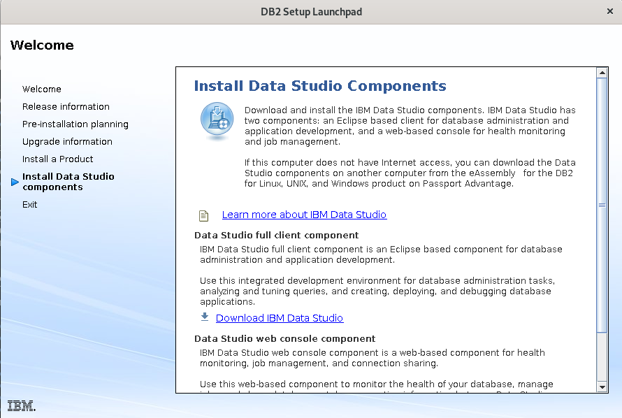
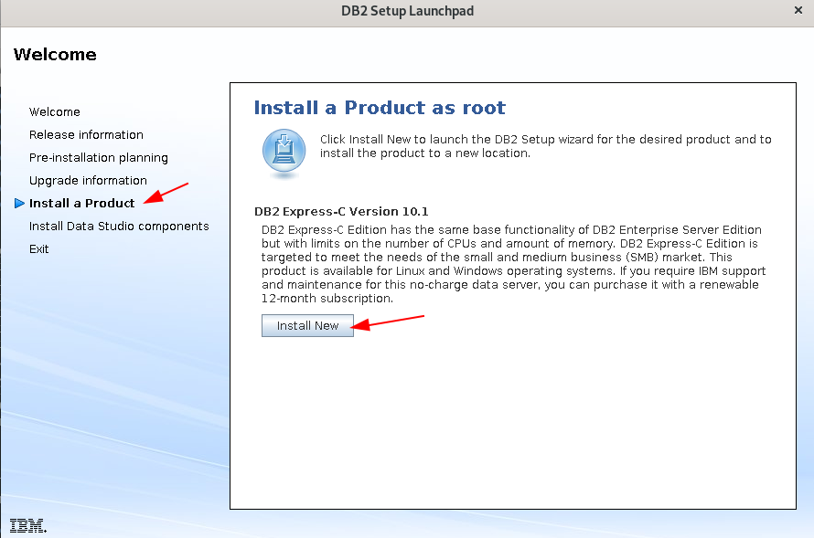

Seleccionar **Install Product**

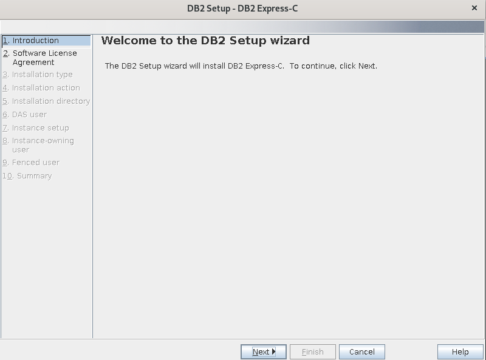
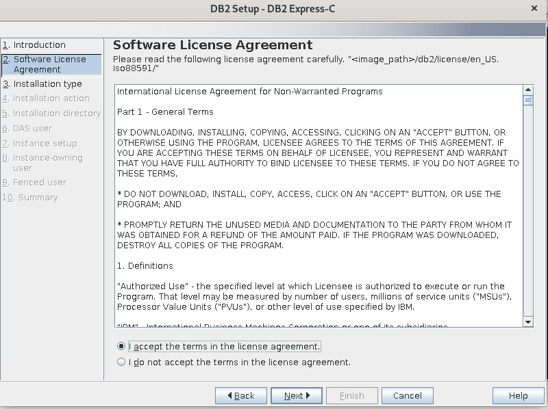
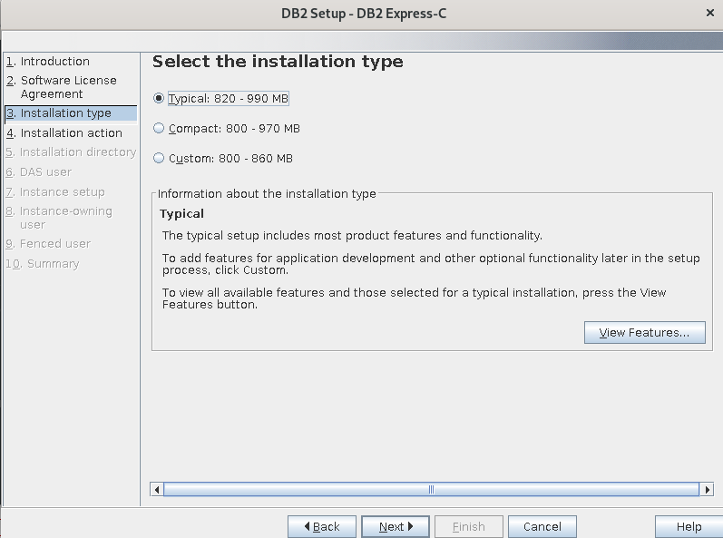
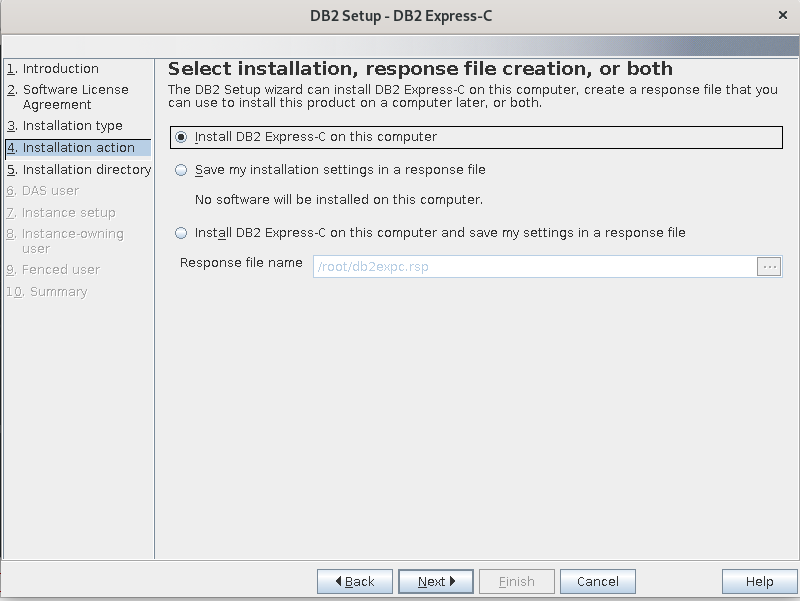
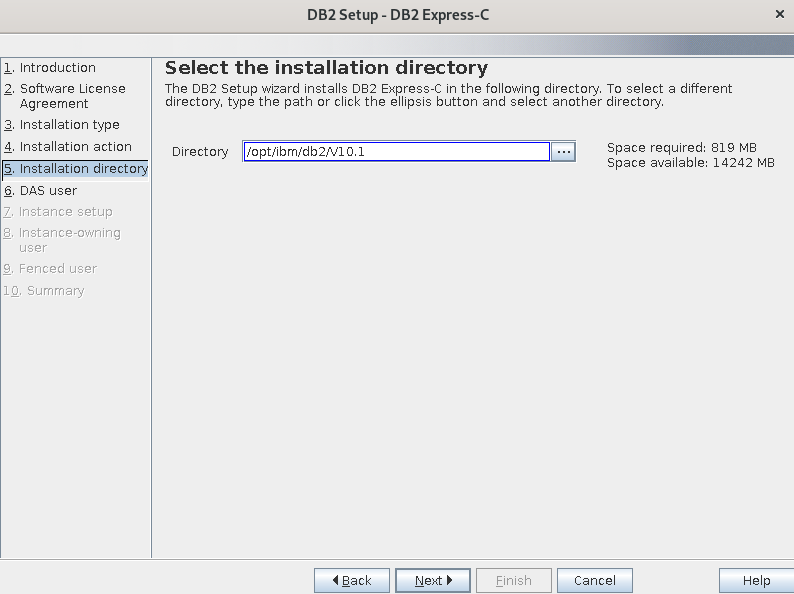

Aquí creamos el Administrador que se requieren para poder instanciar una BD de DB2. La clave que utilizo es Venezuela21.

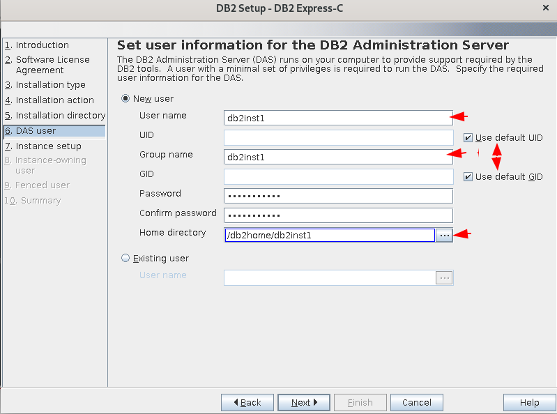
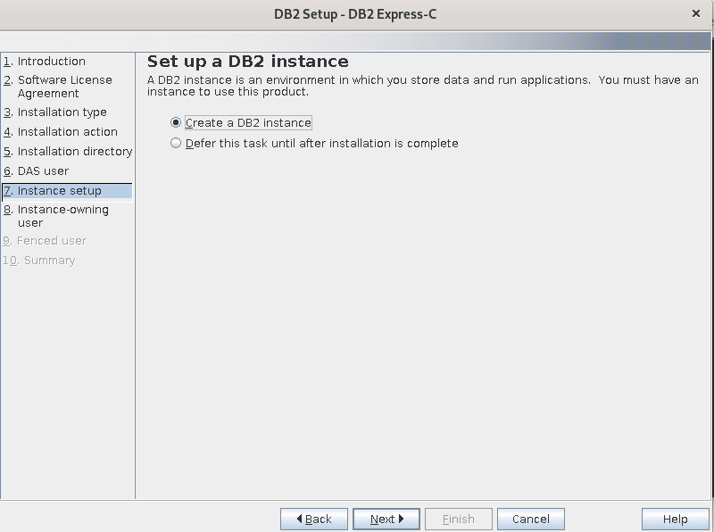

Aquí creamos el Instance Owner de DB2. La clave que utilizo es Venezuela21.

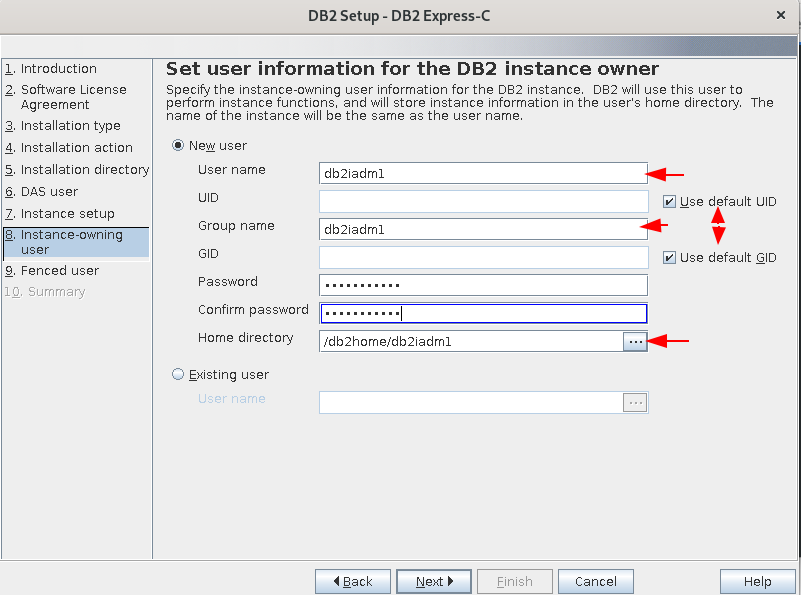

Aquí creamos el Fenced de DB2. La clave que utilizo es Venezuela21.

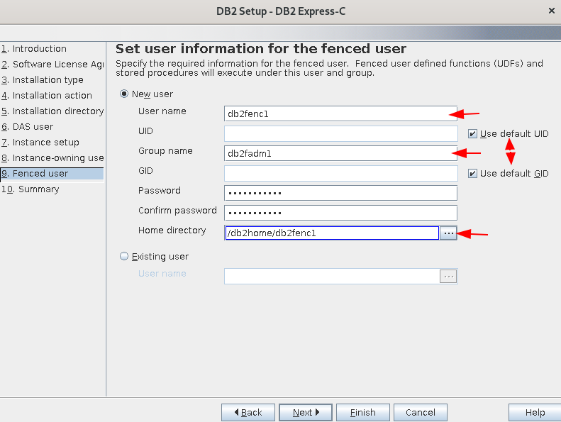

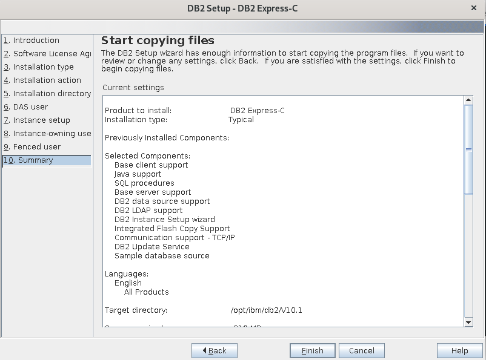

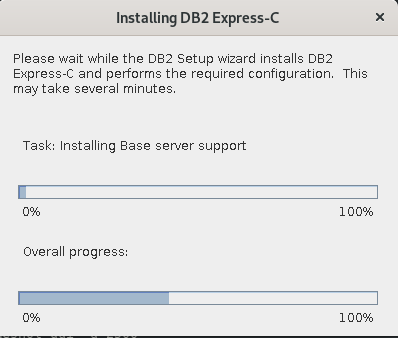

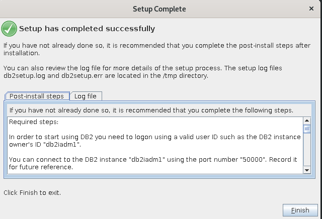

Listo culmina la instalación, ahora vamos a certificar, crear una Base de Datos instanciarla, crear dos (2) tablas de prueba e insertar datos dentro de ella.

Consultamos que este en memoria el IBM DB2::

	# ps -ef | grep db2
	db2inst1  29884      1  0 14:56 ?        00:00:00 /db2home/db2inst1/das/adm/db2dasrrm
	root      37901      1  0 14:57 ?        00:00:00 db2wdog
	db2iadm1  37903  37901  0 14:57 ?        00:00:01 db2sysc
	root      37904  37903  0 14:57 ?        00:00:00 db2ckpwd
	root      37905  37903  0 14:57 ?        00:00:00 db2ckpwd
	root      37906  37903  0 14:57 ?        00:00:00 db2ckpwd
	db2iadm1  37913  37901  0 14:57 ?        00:00:00 db2vend (PD Vendor Process - 1)
	db2iadm1  37920  37901  0 14:57 ?        00:00:00 db2acd   ,0,0,0,1,0,0,0000,1,0,98bd90,14,1e014,2,0,1,11fc0,0x210000000,0x210000000,1600000,8,2,1a
	root      38759   9761  0 15:01 pts/1    00:00:00 grep --color=auto db2

Iniciar con el usuario que administrara la instancia, en este caso es **db2iadm1** y lo podemos certificar en el comando anterior en el dueño del PID 37920 y 37913.::

	# su - db2iadm1
	Last login: Fri Jun  4 15:06:25 EDT 2021 on pts/1

	[db2iadm1@cdc01 ~]$ pwd
	/db2home/db2iadm1

Para estar seguros, detenemos y iniciamos el servicio.::

	$ db2stop
	SQL1064N  DB2STOP processing was successful.

Certificamos que ya no esta la instancia::

	$ ps -ef | grep db2 | grep -v root
	db2inst1  29884      1  0 14:56 ?        00:00:00 /db2home/db2inst1/das/adm/db2dasrrm
	db2iadm1  38887  38886  0 15:07 pts/1    00:00:00 -bash
	db2iadm1  38972  38887  0 15:09 pts/1    00:00:00 ps -ef
	db2iadm1  38973  38887  0 15:09 pts/1    00:00:00 grep --color=auto db2

Iniciamos el proceso nuevamente::

	$ db2start 
	SQL1063N  DB2START processing was successful.

Certificamos que este operativo::

	$ ps -ef | grep db2 | grep -v root
	db2inst1  29884      1  0 14:56 ?        00:00:00 /db2home/db2inst1/das/adm/db2dasrrm
	db2iadm1  38887  38886  0 15:07 pts/1    00:00:00 -bash
	db2iadm1  38981  38979  0 15:11 pts/1    00:00:00 db2sysc
	db2iadm1  38991  38979  0 15:11 pts/1    00:00:00 db2vend (PD Vendor Process - 1)
	db2iadm1  38998  38979  0 15:11 pts/1    00:00:00 db2acd   ,0,0,0,1,0,0,0000,1,0,98bd90,14,1e014,2,0,1,11fc0,0x210000000,0x210000000,1600000,12,2,38
	db2iadm1  39007  38887  0 15:12 pts/1    00:00:00 ps -ef
	db2iadm1  39008  38887  0 15:12 pts/1    00:00:00 grep --color=auto db2

Para obtener mas información.::

	$ db2val
	DBI1379I  The db2val command is running. This can take several minutes.

	DBI1335I  Installation file validation for the DB2 copy installed at
	      /opt/ibm/db2/V10.1 was successful.

	DBI1339I  The instance validation for the instance db2iadm1 was
	      successful.

	DBI1343I  The db2val command completed successfully. For details, see
	      the log file /tmp/db2val-210604_151307.log.

Listamos las base de datos existentes.::

	$ db2 LIST DATABASE DIRECTORY
	SQL1031N  The database directory cannot be found on the indicated file system. 
	SQLSTATE=58031

Como no hay creamos una. Esto va demorar, ten paciencia.::

	$ db2 create database TEST_DB2
	DB20000I  The CREATE DATABASE command completed successfully.

Listamos nuevamente las base de datos.::

	$ db2 LIST DATABASE DIRECTORY

	 System Database Directory

	 Number of entries in the directory = 1

	Database 1 entry:

	 Database alias                       = TEST_DB2
	 Database name                        = TEST_DB2
	 Local database directory             = /db2home/db2iadm1
	 Database release level               = f.00
	 Comment                              =
	 Directory entry type                 = Indirect
	 Catalog database partition number    = 0
	 Alternate server hostname            =
	 Alternate server port number         =

Nos conectamos a la base de datos.::

	$ db2 connect to TEST_DB2

	   Database Connection Information

	 Database server        = DB2/LINUXX8664 10.1.0
	 SQL authorization ID   = DB2IADM1
	 Local database alias   = TEST_DB2

Creamos una tabla de prueba.::

	$ db2 "create table TEST_DB2.TABLE01 (id int, username varchar(20))"
	DB20000I  The SQL command completed successfully.

Insertamos unos registros a la nueva tabla.::

	$ db2 "INSERT INTO TEST_DB2.TABLE01 VALUES(1, 'CarlGom')"
	DB20000I  The SQL command completed successfully.

	$ db2 "INSERT INTO TEST_DB2.TABLE01 VALUES(1, 'LucSan')"
	DB20000I  The SQL command completed successfully.

Consultamos la tabla.::

	$ db2 "select * from TEST_DB2.TABLE01"

	ID          USERNAME            
	----------- --------------------
		  1 CarlGom             
		  1 LucSan              

	  2 record(s) selected.

Listamos todas las tablas.::

	$ db2 list tables for all | grep TABLE01
	TABLE01                         TEST_DB2        T     2021-06-04-15.25.12.933951

Consultamos que DB2 este escuchando por su puerto que es el 5000.::

	$ netstat -natp | grep db2
	(Not all processes could be identified, non-owned process info
	 will not be shown, you would have to be root to see it all.)
	tcp        0      0 0.0.0.0:50000           0.0.0.0:*               LISTEN      38981/db2sysc  

Tips
++++++++

Si les genera errores de **logarchmeth1 LOGRETAIN**, **LOG_DDL_STMTS** o **DFT_SCHEMAS_DCC**::

	[db2inst3@db2 ~]$ db2 "update db cfg for TEST_DB2 using logarchmeth1 LOGRETAIN"
	DB20000I  The UPDATE DATABASE CONFIGURATION command completed successfully.

	SQL1363W  Database must be deactivated and reactivated before the changes to
	one or more of the configuration parameters will be effective.

	[db2inst3@db2 ~]$ db2 "update db cfg for TEST_DB2 using LOG_DDL_STMTS YES"
	DB20000I  The UPDATE DATABASE CONFIGURATION command completed successfully.

	[db2inst3@db2 ~]$ db2 "update db cfg for TEST_DB2 using DFT_SCHEMAS_DCC YES"
	DB20000I  The UPDATE DATABASE CONFIGURATION command completed successfully.

Si no permite continuar porque esta pendiente un backup::

	$ db2 "backup db TABLE01 to /db2home/db2inst2/backupdb"
	Backup successful. The timestamp for this backup image is : 20210603102922

	$ ls backupdb/
	SOURCE.0.db2inst2.DBPART000.20210603102922.001

Esto es para listar tablas o vistas::

	$ db2 list tables for schema TABLA01

